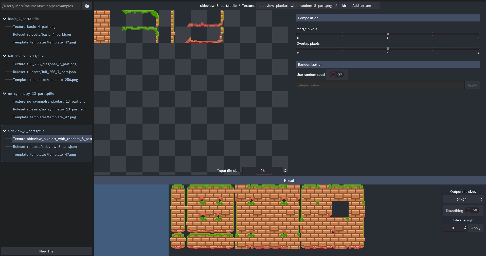

## Roadmap for the 2.0 release

- In the tile main view: highlight what parts are used
- Generation start logic (On every change basically. Now it's only tied to the change in the sliders)
- Randomization
- Output settings use in generation
- Ruleset validity checks
- New tile creation UI
- Migrate all the examples
- Result preview: show one enlarged subtile in the left rectangle
- Add Godot export
- All-in-one folder-project export
- Testing and fixes
- Docs

# TilePipe2
## Tilepipe is autotiling tileset generator

The project is meant to be a part of the artist pipeline when creating 2D tilesets for game development. Instead of 47 or 255 tiles you can draw only a couple of parts (like corners) that differ and have everything else generated.
 
This is the second iteration of the project, here's the original TilePipe project page on itch.io https://aleksandrbazhin.itch.io/tilepipe. It's source can be found in the respectable git branch.

## About tiling in general

## Using TilePipe2
### Glossary
- Tileset
- Tile
- Subtile
- Ruleset
- Template

### Basic usage on provided examples

### Creating your own tiles

- Project logic (add/use)

First any tile asset has to be added or copied into the project folder. You can do it yourself or with the help of the provided GUI. But the easiest way is to just start off with one of the examples.
- Input Textures are png images, consisting of tile parts that are used to construct all of the subtiles.
- Templates are also png images, but only those placed in the templates/ subfolder of your project. They consist of 32x32 squares, every of which is divided into 9 smaller squares. Each of those nine represent tile's neighbor, which will affect the selection of the subtile. The smaller squares can be either white or transparent (no neighbor) or of any other color (there is some neighbor). The central square represents the tile itself and if it's white, no subtile will be rendered at all. These template images are then recognized by TilePipe and the result is composed by this templates. The format could as well be text or JSON based, but images are easier to manipulate for an artist.
- Rulesets are sets of rules dictating which parts should be used in which order to create a specific subtile. They are a JSON files, which are then visualized in a separate tab in TilePipe. You can change them in any text editor ot create any kind of rules. Some of the rulesets in the examples are the most useful, so just copy them to the rulesets/ subfolder of your project. There is a JSON schema, specifying the format and autochecker script.

GUI tour:
- Main View 
- Template
- Ruleset
- Exporting

## Motivation behind the TilePipe2
1. Perfectionism
2. Ability to save and use custom rulesets (previously named presets). These are now json files, schema is included in the project. There is a viewer in the GUI.
3. Project-like logic for every directory. Several tile sources now from a project, which can be exported at once.
4. Every data is now explicit, there is minimal built-in logic (not examples, not templates, not rulesets). It's a VCS-ready approach, all the changes are now trackable. Everything previously built-in os now distributed as the examples.

## Screens
Tile main view (overview)

Ruleset viewer

Texture setup

## Roadmap for the future
- Setup tile input - where to get the numbered parts. That way it will be possible to use existing tilesets like rpgmaker ones.
- Rotated tiles - for isometric tilesets
- Rectangle tiles (not square) 
- Animation export (side by side tiles blocks)
- Export the entire directory as a project at once
- Export to Tiled (https://www.mapeditor.org/)
- Ruleset GUI editor
- Template GUI editor
- Shader-based effects on tile merges
- Rebuild Godot export presets for optimized export