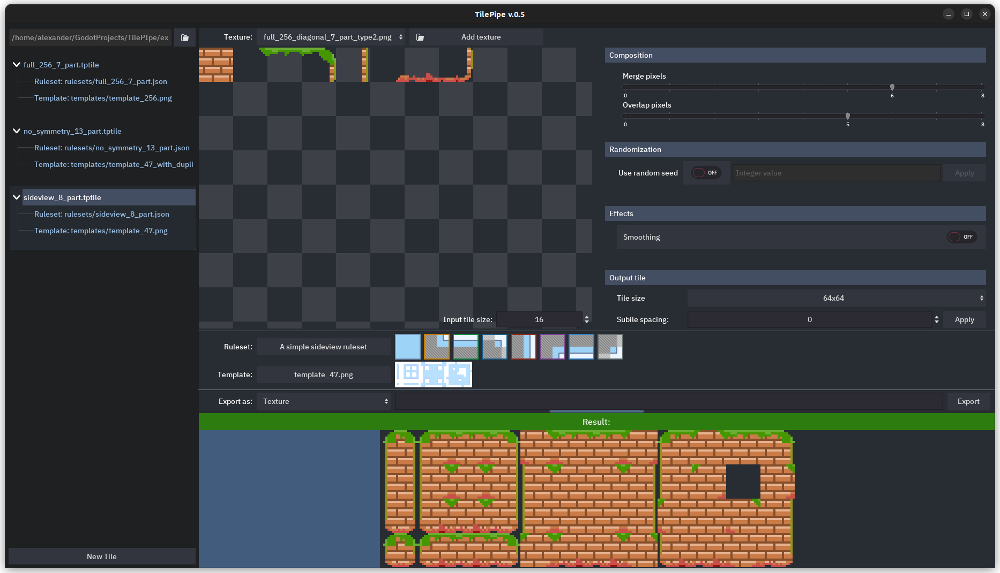
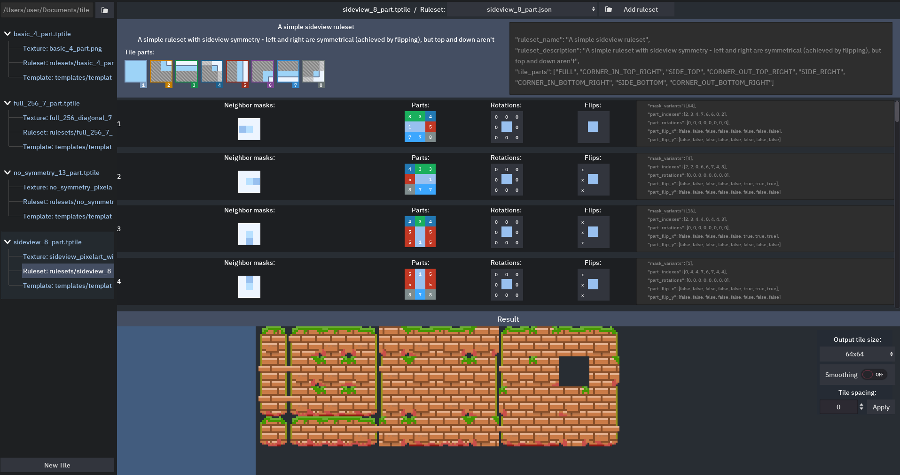

# Tilepipe is autotiling tileset generator

- Project page on itch.io https://aleksandrbazhin.itch.io/tilepipe
- Tutorial for version 0.4.x https://aleksandrbazhin.github.io/tilepipe_site/tutorial.html

## The 0.5 branch 
It is full rework of logic and UI. Main differences
- Ability to use custom rulesets (previously named presets). Those are json files, json schema included in the project. There is a viewer in the GUI.
- Project-like logic for every directory
- Everything is explicit, minimal built-in logic (not examples, not templates, not rulesets). Tile settings are a separate json file by extension .tptile. It's VCS-ready and resolves a lot of problems wuth UI logic.

## Screens
Tile main view

Ruleset viewer

## Roadmap for 0.5 branch before the release
0.5 is not ready to be released, there is not much work left, but I am not sure when and if it will be finished

- Randomization
- Generation start logic (On every change basically. Now it's only tied to the change in the sliders)
- Output settings use in generation
- Ruleset validity checks
- New tile creation UI
- Migrate all the examples
- In the tile main view: highlight what parts are used
- (Optional) Result preview: show one enlarged subtile in the left rectaangle
- Add Godot export
- Testing and fixes

## Roadmap for the future
- Setup tile input - where to get the numbered parts. That way it will be possible to use existing tilesets like rpgmaker ones.
- Rotated tiles - for isometric tilesets
- Rectangle tiles (not square) 
- Animation export (side by side tiles blocks)
- Export the entire directory as a project at once
- Export to Tiled (https://www.mapeditor.org/)
- Ruleset GUI editor
- Template GUI editor
- Shader-based effects on tile merges
- Rebuild Godot export presets for optimized export