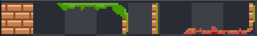
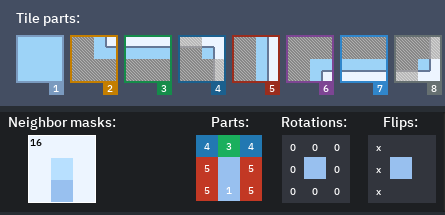
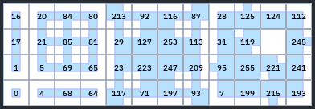
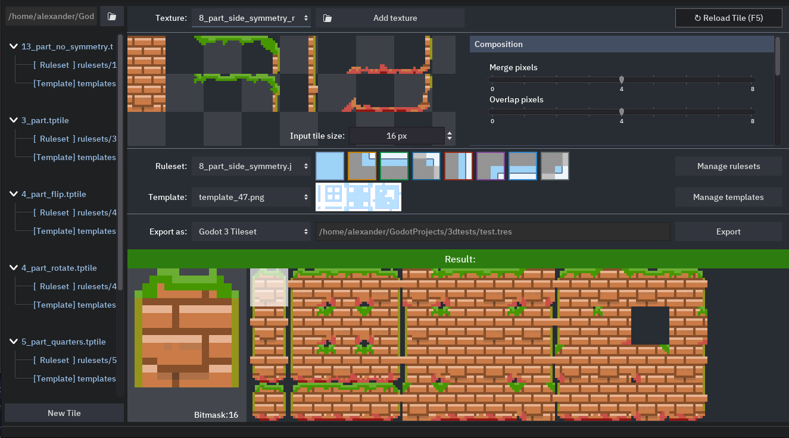

# TilePipe2

## Intro
Most game engines supporting 2D also support autotiling - substituting a tile variant depending on it's neighbors. That way a level designer is able to paint a terrain with one tile and have a tile variant set up automatically. To create such an autotile an artist has to copy and paste one tile multiple times to create all possible tile variations by hand and then, if there is a need to update something, he has to do it again. 

The project is meant to be a part of an artist's pipeline when creating 2D autotiling tilesets for game development. Instead of 47 or 255 tiles one can draw only a couple of parts (like center, sides and corners) that differ and have everything else generated.

The name TilePipe comes from “tileset pipeline”. This is the second iteration of the project, here's the original TilePipe project page on itch.io https://aleksandrbazhin.itch.io/tilepipe. It's source can be found in the respectable git branch.

The (alpha) binaries for version 2 can be found [on itch.io here](
https://aleksandrbazhin.itch.io/tilepipe2)

## How it works

It takes an input textures 

Applies some rules to combine them

And places the result in a grid as defined by the template

To get the result ready for autotiling

All three input parts can and are supposed to be modified by a user. But you can use rulesets and templates from the example folder, they should cover a lot of cases.

Some aspects of how the parts are combined can be set up through the UI. 
- How much pixels should sides overlap the center (merge and overlap sliders)
- Randomization
- Resize
- Filtering (smoothing)

## Motivation behind the project
There are several projects that address this issue, namely [LDtk](https://ldtk.io/) (opensource) and TileSetter (proprietary). Both include a tilemap editor. 

With this project is aimed to implement the most straightforward approach to generating autotiles, leaving the map editing to be done in the game engine. Currently the project supports only plain texture export or Godot3.x tileset format. But other exporters are planned, namely for the [Tiled](https://www.mapeditor.org/) level editor.

Important part of the project is being open, so the creators can rely on it in the long run safely and invest their time into learning it and setting up their own templates and rulesets.

## About tiling in general
There are several different types of autotiling, some of which can be implemented with the help of TilePipe2. The most common type of autotile is "47-tile blob", which takes into accounts both neighboring sides and corners. You can read more on tiling on this resource: [http://www.cr31.co.uk/](http://www.cr31.co.uk/stagecast/wang/blob.html). In the program [Tiled](https://www.mapeditor.org/) this type of tilesets is called “Mixed sets” with 2 types of terrain. But this is not the only type, which TilePipe2 can be used for. There are examples for 16-tile blobs as well as full 256-tile ones. You can create your own set of rules (called "ruleset") to use TilePipe2 to generate practically anything with up to 256 result tile variations.

## Tutorial

### Terms
- **Tile**. A specific type of terrain. It is something you can your draw your map with. It can have multiple variants which are substituted depending on it's neighbors.
- **Subtile**. Is one tile variant, which is used for substitution. Variants differ like the tile on the edge of zone differs from the inner tiles.
- **Tileset**. A collection of tiles used in the game engine or level editor. Some tiles can be "autotiles", some can be plain and simple. 
- **Input texture**. A drawing consisting of all the parts that are used in a tile. What parts you need to draw depends on what ruleset you use. As of release of TilePipe2.0 version all the parts need to be placed in a row. You can have some of them randomly subsitiuted to have variety, for this you need to place parts below each other in a grid. Each row will be recognized as a variant of a part in the top column. These are randomly selected when creating each subtile - randomization.
- **Tile part**. A part which is to be combined to create each subtile. First part in the input texture is always supposed to be a tile center. How many you need for sides and corner depends on what ruleset you use. Each subtile always consists of 9 parts: center and 8 side and corner parts which are placed on top of it.
- **Neighbor bitmask**. In the template tab you can see the numbers over each subtile. These are bitmasks of the 8 neighboring tile of the same type. They are counted from the top clockwise, if there is a neighbor we have a 1 in binary representation of that number, otherwise we have zero. So they differ from zero for a subtile with no neighbors to 255 for a tile fully surrounded by the same terrain.
- **Ruleset**. Rulesets are sets of rules dictating which parts should be used in which order to create a specific subtile. They are a JSON files, which are then visualized in a separate tab in TilePipe. You can change them in any text editor ot create any kind of rules. Some of the rulesets in the examples are the most useful, so just copy them to the rulesets/ subfolder of your project. There is a JSON schema, specifying the format and autochecker script. Here is a [documentation ruleset schema](docs/Rulesets.md)
- **Template**. Templates are also png images, but only those placed in the templates/ subfolder of your project. They consist of 32x32 squares, each of which is divided into 9 smaller squares. Each of those nine represent tile's neighbor, which will affect the selection of the subtile. The smaller squares can be either white or transparent (no neighbor of the same tile) or of any other color (there is a neighbor). The central square represents the tile itself and if it's white, no subtile will be rendered at all. These template images are then recognized by TilePipe and the result is composed by this templates. The format could as well be text or JSON based, but images are easier to manipulate for an artist.

## Using TilePipe2

TilePipe2 just generates all the subtiles needed for creating an autotile from the tile parts provided in the input texture. The resulting subtiles are placed as defined in the template. For every bitmask defined in the template, the program first looks for a rule in the ruleset, then combines the input tile parts to generate a subtile for this specific bitmask.

First of all you need to draw the parts that are repeated in tiles. This is a drawing specific to ruleset you use. For example, if you have a sideview game, your tiles may be symmetrical left to right but not symmetrical top to down. So you'll need different parts for top and down of tiles, but can use only one side. And sides must be flipped, but not rotated. That's the ruleset named in the examples "8_part_side_symmetry", and there is also an input texture for it with an example tile setup.

You can also setup a template, which determines places for the tiles in the resulting tileset, but in most cases you are good with the default.  If you still want to do it, just rearrange tiles in the example texture.

### TODO: Basic usage on provided examples

### TODO: Creating your own tiles

- Project logic (add/use)

First any asset has to be added or copied into the project folder. You can do it yourself or with the help of the provided GUI. But the easiest way is to just start off with one of the examples.

### TODO: GUI tour:

GUI screenshot

- Main View 
- Template
- Ruleset
- Exporting

## Motivation behind the TilePipe2 rewrite over TilPipe
1. The project GUI logic became too complicated with no room to add new features.
2. Ability to save and use custom rulesets (previously named presets). These are now json files, schema is included in the project. There is a viewer in the GUI.
3. Project-like logic for every directory. Several tile sources now from a project, which can be exported at once.
4. Every data is now explicit, there is minimal built-in logic (not examples, not templates, not rulesets). It's a VCS-ready approach, all the changes are now trackable. Everything previously built-in os now distributed as the examples.

## Roadmap for the future
- Ruleset validity checks
- Setup tile input - position where to get the numbered parts. That way it will be possible to use existing tilesets like rpgmaker ones.
- Rotated tiles - for isometric tilesets
- Rectangle tiles (not square) 
- Non-equal subtile offsets
- Setup randomization frequency
- Animation export (side by side tiles blocks)
- Export the entire directory as a project at once
- Export to Tiled (https://www.mapeditor.org/)
- Ruleset GUI editor
- Template GUI editor
- Shader-based effects on tile merges
- Rebuild Godot export presets for optimized program size